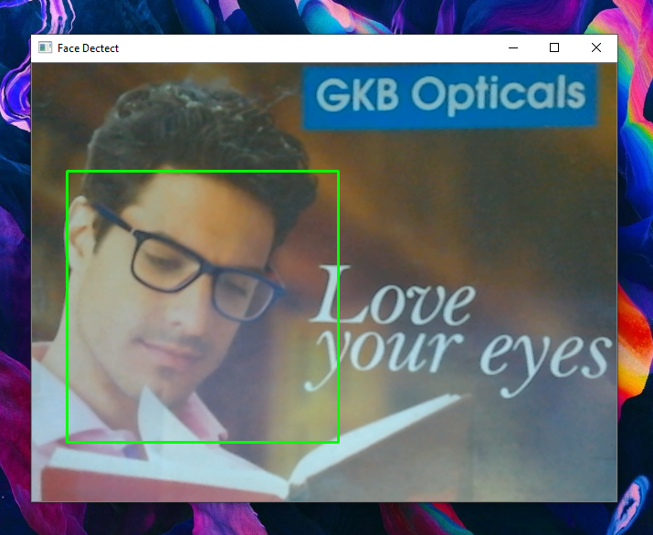

# Face-Detection
Code is written to fetch real time result of which thing can be told as an human face.
It uses square boxes to mark the faces and the size of the square depends upon face size.

## Screenshot

